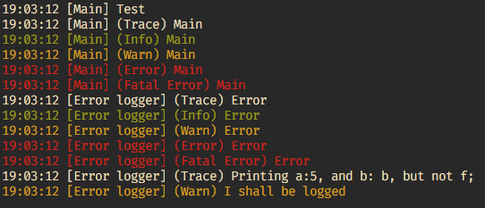

CppLogger2
==========
The second version of the CppLogger library.

# Usage

**A wiki is in construction, please wait for better usage examples, and last features tutorials**

All the example below are shown in the next screenshot.

``` cpp
// Creating a logger (the last parameter is false by default and
//  if is set to true it will exit after a printFatalError())
CppLogger::CppLogger mainLogger(CppLogger::Level::Trace, "Main"/*, true*/);

// Trace level log
mainLogger.printTrace("Test");

// Create a format for your logger (the order of the format is respected)
CppLogger::Format mainFormat({
CppLogger::FormatAttribute::Time,
CppLogger::FormatAttribute::Name,
CppLogger::FormatAttribute::Level,
CppLogger::FormatAttribute::Message
});

// Apply the format to your logger
mainLogger.setFormat(mainFormat);

// Different levels of logging
mainLogger.printTrace("Main");
mainLogger.printInfo("Main");
mainLogger.printWarn("Main");
mainLogger.printError("Main");
mainLogger.printFatalError("Main");

CppLogger::CppLogger errorLogger(CppLogger::Level::Trace, "Error logger");

errorLogger.setFormat(mainFormat);

// Ouput to std::cerr
errorLogger.setOStream(std::cerr);

errorLogger.printTrace("Error");
errorLogger.printInfo("Error");
errorLogger.printWarn("Error");
errorLogger.printError("Error");
errorLogger.printFatalError("Error");

int a = 5;
char b = 'b';
std::string str = "I shall be logged";
float f = 5.4f;

// C style logging.
errorLogger.printTrace("Printing a:{}, and b: {}, but not f;", a, b, f);
errorLogger.printWarn("{}", str);

```


### To Do
* Let the user define the color of each level.
* Add more format options.
* Write logs to files.
* Let the user enable or disable the logger when wanted.
